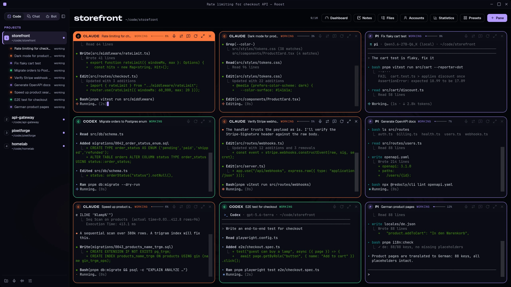
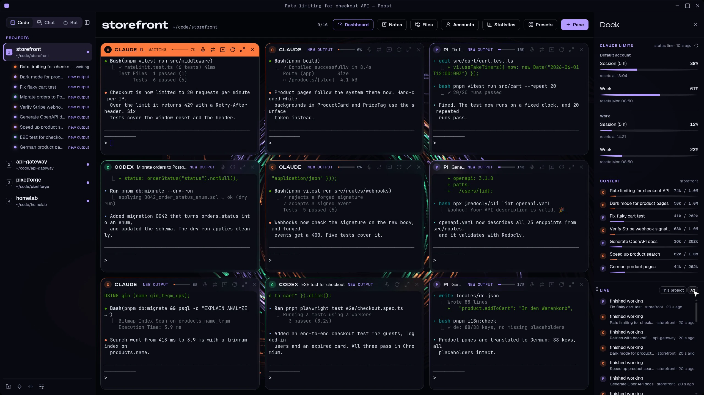
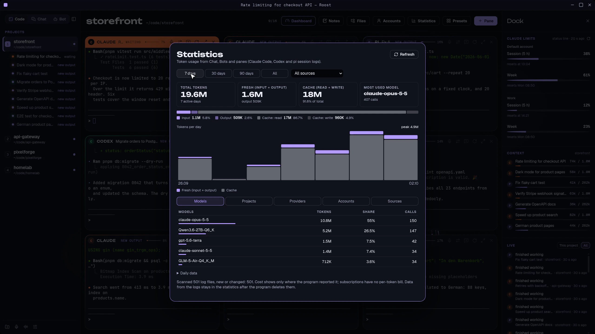
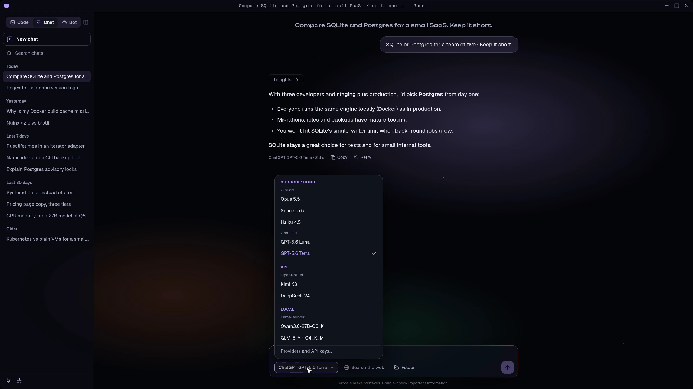
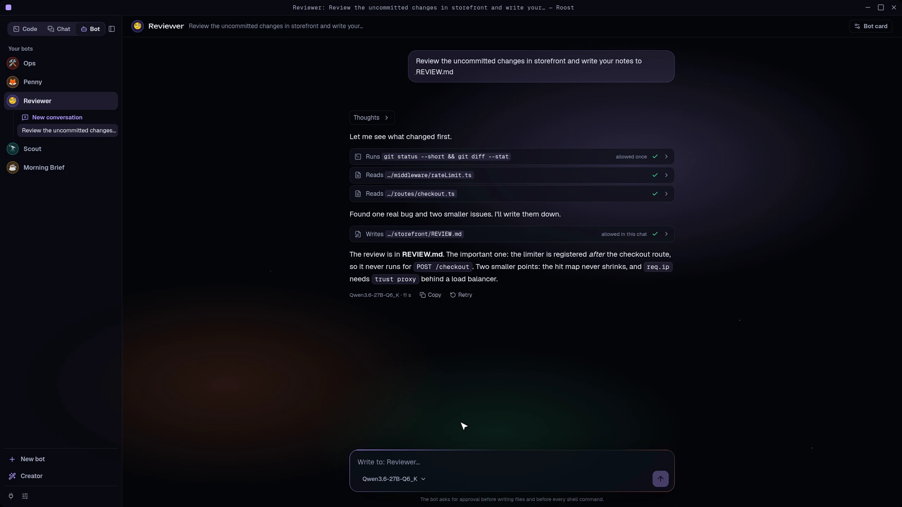
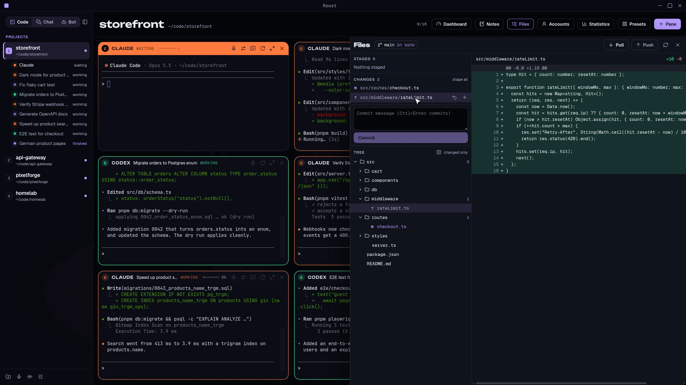
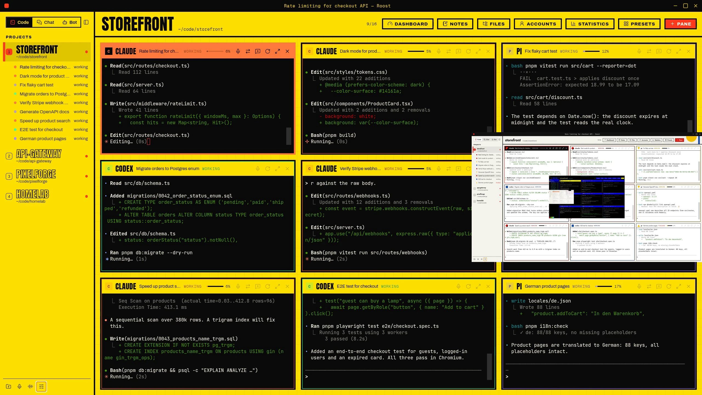

**Polski** · [English](README.md)

# Roost

*Rule the roost.*

https://github.com/user-attachments/assets/6798c7fb-9c21-4cbf-a05f-db971493c9fd

Desktopowa aplikacja (Electron + React + TypeScript, tylko Linux) do pracy z wieloma
agentami CLI naraz. Po lewej szyna z projektami (folderami), po prawej siatka 1–16
terminali aktywnego projektu. Przełączenie projektu nie zatrzymuje procesów —
schowane siatki żyją dalej.

Każdy panel to prawdziwy PTY (`node-pty`) renderowany przez xterm.js. Panel
uruchamia agenta w folderze projektu i pilnuje UUID rozmowy, żeby po restarcie
aplikacji wrócić do tych samych rozmów.

Interfejs jest po **polsku i angielsku**. Domyślnie idzie za językiem systemu (polski system
dostaje polski, reszta angielski); zmiana w **Wygląd → Język**.

## Funkcje

- **Code** — siatka terminali opisana wyżej: presety, zamiana paneli przeciąganiem, Shift+przeciągnięcie przekazuje
  streszczenie rozmowy do innego panelu, upuszczony plik wpisuje swoją ścieżkę, Pulpit
  z limitami Claude i zużyciem kontekstu, Ctrl-klik na `ścieżka:linia` w terminalu, powiadomienie,
  gdy ukryty agent skończy pracę.
- **Czat** — zakładka rozmowy w stylu claude.ai. Modele: Claude i ChatGPT z subskrypcji
  (`claude -p`, `codex exec`), klucze API (w systemowym sejfie), modele lokalne (llama-server).
  Model można zmienić w środku rozmowy, jest wyszukiwanie w sieci ze źródłami.
- **Bot** — własne boty z osobowością, trwałą pamięcią, skillami zapisywanymi przez samego bota,
  narzędziami (sieć, pliki, powłoka; zapis i polecenia najpierw pytają o zgodę) i harmonogramem
  działającym, gdy aplikacja jest otwarta. Wbudowany Kreator tworzy bota z opisu.
- **Głos** — dyktowanie do dowolnego panelu i rozmowa głosowa na żywo (mikrofon → rozpoznawanie
  mowy → model → mowa), która potrafi też otwierać i czytać panele.
- **Pliki i git** — panel boczny z drzewem projektu, diffem, stage/unstage/discard, commitem,
  pull i push.
- **Konta** — kilka loginów Claude/Codex i „kontynuuj na innym koncie” przy limicie (niżej).
- **Wygląd** — ponad 20 motywów, interfejs po polsku i angielsku.

## Zrzuty ekranu



| | |
|---|---|
|  |  |
| Pulpit: limity Claude dla każdego konta, kontekst paneli, feed na żywo | Statystyki tokenów: dni, modele, projekty, dostawcy, konta |
|  |  |
| Czat: subskrypcje, API i modele lokalne w jednym wyborze | Bot: recenzent czyta diff i za zgodą zapisuje uwagi |
|  |  |
| Pliki i git: diff, stage, commit, push | Ponad 20 motywów |

## Pobieranie

Gotowy AppImage (Linux x86_64): **[Releases](https://github.com/tonieMajke/roost/releases/latest)**.

```bash
chmod +x Roost-*.AppImage
./Roost-*.AppImage
```

Obok każdego wydania leży plik `.sha256` (`sha256sum -c Roost-<wersja>.AppImage.sha256`). Agenci
nie są dołączeni — patrz „Wymagania” niżej. Jeśli nie startuje, zajrzyj do sekcji [Rozwiązywanie problemów](#rozwiązywanie-problemów).

## Wymagania

Linux, Node.js i pnpm do budowania ze źródeł. Agenci nie są dołączeni; zainstaluj tych, których
używasz, i dopilnuj, by były w `PATH`: `claude`, `codex`, `pi`. Opcjonalnie: `git` i `rg`
(panel plików, narzędzia botów), `piper-tts` (lokalna mowa; w Arch/AUR binarka nazywa się
`piper-tts`, nie `piper`), serwer zgodny z `whisper` do dyktowania.

## Uruchomienie

```bash
pnpm install
pnpm desktop          # okno Electron (build + start; raz wcześniej: cd electron && npm install)
```

Produktowo: `pnpm electron:dist` (`electron/release/Roost-<wersja>.AppImage`).
Dawna wersja Tauri leży w `legacy-tauri/` (nieużywana, patrz jej README).

Backend w Node (`electron/src/`, IPC przez `preload.ts` → `src/backend-electron.ts`),
konfiguracja w `~/.config/dev.majke.roost/` (`ROOST_CONFIG_DIR` przestawia ją na inną –
nie uruchamiaj dwóch kopii naraz na wspólnym `workspace.json`). Przy pierwszym starcie po zmianie nazwy z „Agents” stary katalog
`~/.config/dev.majke.agents/` jest kopiowany do nowego (stary zostaje jako kopia zapasowa).

Sprawdzenia (te same uruchamia CI):

```bash
pnpm install && (cd electron && npm ci && npm run build)   # testy potrzebują node-pty i out/mcp-server.cjs
pnpm typecheck && pnpm test && (cd electron && npm run typecheck)
```

### Podgląd w przeglądarce (bez procesów)

```bash
pnpm dev              # http://localhost:5183
```

Ten sam interfejs z udawanymi terminalami (banner `[podgląd] …`, `exit`, `fail`).
Stan układu trafia tu do `localStorage` (klucz `aw-workspace`) zamiast do pliku.
Służy do sprawdzania układu i stylów bez otwierania okna na pulpicie.

## Pliki konfiguracyjne

W `~/.config/dev.majke.roost/`:

- `agents.json` — lista agentów (tworzona z domyślnymi wpisami przy pierwszym starcie).
  Uszkodzonego pliku aplikacja nie nadpisuje, tylko pokazuje błąd w pasku.
- `accounts.json` — konta agentów (opcjonalny; powstaje, gdy dodasz pierwsze konto w oknie „Konta”).
- `claude-limits.json`, `claude-limits.<id konta>.json` — ostatnie limity subskrypcji Claude z linii statusu.
- `workspace.json` — układ (projekty, panele, UUID sesji, presety). Zapisywany przy
  każdej zmianie. Ścieżki bywają skracane do `~/…` (rozwijane przy starcie procesu).
- `workspace.<RRRR-MM-DD>.bak` — kopia przed pierwszym zapisem, gdy plik był
  nieczytelny lub nie do parsowania (jedna na dzień, bez nadpisywania).

### Agenci

Domyślnie: `claude`, `pi`, `shell` (Terminal). Plik ma postać `{ "agents": [...] }`:

```json
{
  "agents": [
    { "id": "claude", "name": "Claude", "command": "claude",
      "session": { "new": ["--session-id", "{session}"], "resume": ["--resume", "{session}"], "check": "claude" } },
    { "id": "codex", "name": "Codex", "command": "codex",
      "args": ["--sandbox", "workspace-write"] }
  ]
}
```

codex nie przyjmuje UUID przy tworzeniu rozmowy, więc nie ma tu `session`: panel codexa
po restarcie aplikacji startuje od nowa (`codex resume` można wpisać w nim ręcznie).

- `command` — program do uruchomienia; `$SHELL` jest rozwijany przez aplikację.
- `args` — stałe argumenty, zawsze przed argumentami sesji.
- `session.new` / `session.resume` — argumenty na start nowej rozmowy / wznowienie;
  `{session}` zastępuje się UUID panelu. Bez `session` panel zawsze startuje od nowa.
- `session.check: "claude"` — przed wznowieniem aplikacja sprawdza, czy plik rozmowy
  istnieje w `~/.claude/projects/*/<uuid>.jsonl` (dla innych agentów: zawsze „nowa”).

Nowy agent od razu pojawia się w „+ Panel” i może wejść w skład presetu.

## Presety

`Presety` w nagłówku: wbudowane („Claude + pi”, „2× Claude + 2× pi”, „4× Claude”),
własne oraz „Zapisz obecny układ…” (z paneli aktywnego projektu, w ich kolejności).
Wybrany preset dopisuje panele na koniec aktywnego projektu, do limitu 16 — o
pominiętych panelach i agentach spoza `agents.json` mówi komunikat nad siatką.
Własne presety są w `workspace.json` (`presets`), wbudowane w kodzie (`src/presets.ts`).
W projekcie bez paneli presety wbudowane stoją obok „+ Panel”.

## Przeciąganie paneli, plików i kontekstu

- **Zamiana paneli:** złap panel za nagłówek i przeciągnij na inny. Panel zwija się w kulkę, która
  leci za kursorem; upuszczenie zamienia oba miejscami. Procesy pracują dalej, nic się nie
  restartuje. Esc albo upuszczenie gdzie indziej anuluje.
- **Przekazanie kontekstu (Shift + przeciągnięcie):** przytrzymaj Shift w trakcie przeciągania
  (można go wcisnąć w locie) i upuść panel na inny. Rozmowa źródłowa zostaje streszczona w kilku
  punktach – cel, co zrobiono, decyzje, dotknięte pliki, co zostało otwarte – i wklejona do panelu
  docelowego **bez Entera**, z miejscem na twoje polecenie pod spodem. Celem może być dowolny
  agent: świeży Claude, pi na lokalnym modelu, inne konto. Panel źródłowy zostaje bez zmian.
  Streszczenie robi Haiku na domyślnym koncie Claude (najwyżej 1500 znaków); gdy się nie uda,
  wkleja się skrócony wyciąg z rozmowy. Czytać umiemy tylko rozmowy Claude i pi, więc panel Codexa
  albo powłoki nie może być źródłem.
- **Nowa rozmowa ze streszczeniem:** to samo streszczenie jest pod ikoną ⇄ w nagłówku panelu
  („Kontynuuj gdzie indziej”) – otwiera **nowy** panel, na innym koncie albo z innym agentem,
  i wkleja do niego streszczenie. Przydaje się, gdy długa sesja zapchała kontekst, a chcesz
  pracować dalej w czystej rozmowie bez gubienia wątku.
- **Upuszczanie plików:** przeciągnij pliki z menedżera plików na panel, a ich ścieżki wpiszą się
  w prompt, w cudzysłowie dla powłoki i bez Entera.

## Konta i kontynuacja na innym koncie

Kilka subskrypcji (np. praca i prywatne) albo limit, który właśnie się skończył? **Konto** to
osobny folder logowania agenta: dla Claude `CLAUDE_CONFIG_DIR`, dla Codexa `CODEX_HOME`.
Aplikacja zna tylko ścieżkę folderu i ustawia zmienną dla procesu panelu. Tokenów nie czyta,
nie kopiuje ani nie zapisuje; logowanie robi sam agent.

- **Dodawanie:** przycisk `Konta` w nagłówku. Podajesz agenta, nazwę i folder (np. `~/.claude-praca`).
  `Zaloguj` otwiera panel agenta na tym koncie, a on sam pokazuje ekran logowania. Folder tworzy agent.
  „Domyślne konto” to zwykły folder agenta (`~/.claude`, `~/.codex`), bez zmiennej; ● oznacza
  konto, które dostają nowe panele.
- **Wybór w panelu:** „Nowy panel” ma rząd „Konto” przy Claude i Codexie. Konto zapisuje się w panelu
  na stałe, więc zmiana domyślnego nie przesuwa działających paneli (sesje leżą w folderze konta).
  W nagłówku panelu jest plakietka z nazwą konta.
- **Limity:** każde konto Claude ma własny plik limitów i własny blok w „Pulpicie”.
- **Przy limicie:** gdy okno limitu konta dojdzie do 100 %, panel pokazuje pasek z resetem i
  opcjami „Kontynuuj gdzie indziej” albo „Poczekam”. To samo jest zawsze pod ikoną ⇄ w nagłówku
  panelu. Kontynuacja otwiera **nowy** panel (inne konto tego samego agenta albo inny agent, np. Codex)
  i wkleja do niego streszczenie rozmowy, bez Entera. Wznowienie tej samej sesji na innym koncie
  nie jest możliwe, bo sesje są per konto.

Ograniczenia: wyciąg rozmowy umie czytać tylko Claude i pi, więc „Kontynuuj” nie ma w panelach
Codexa; limity wykrywamy tylko dla Claude; streszczenie robi Haiku na domyślnym koncie Claude
(gdy jest wyczerpane, wkleja się skrócony wyciąg).

## Skróty klawiszowe

| Klawisz | Akcja |
| --- | --- |
| Ctrl+Alt+←/→/↑/↓ | fokus panelu w siatce |
| Ctrl+Alt+Enter | maksymalizuj / przywróć panel |
| Ctrl+Alt+N | nowy panel (wybór agenta: 1–9, ↑↓, Enter, Esc) |
| Ctrl+Alt+P | nowy projekt (pyta o katalog) |
| Ctrl+Alt+1…9 | przejdź do projektu numer N |
| Ctrl+Alt+B | zwiń / rozwiń szynę projektów (56 px samych klawiszy i kropek) |
| Ctrl+Alt+D | pokaż / ukryj Pulpit |
| Ctrl+Alt+C | przełącz Code → Czat → Bot |
| Ctrl+Alt+`+` / `-` / `0` | rozmiar czcionki terminala: większy / mniejszy / domyślny |
| Ctrl+Alt+R | uruchom ponownie aktywny panel |
| Ctrl+Alt+W | zamknij aktywny panel (przy żywym procesu: drugi raz = „Na pewno?”) |
| Ctrl+F / Ctrl+G / Ctrl+Shift+G | szukaj w terminalu / następne / poprzednie trafienie (Esc zamyka) |
| Ctrl+Shift+C / Ctrl+Shift+V | kopiuj zaznaczenie / wklej do aktywnego panelu |

Przenoszenie paneli z klawiatury (Ctrl+Alt+Shift+strzałki) może być zajęte przez środowisko pulpitu.

Zwyczajne Ctrl+C i Ctrl+V nie są przechwytywane — trafiają do procesu (SIGINT,
wklejenie obrazka w claude). Kropka w nagłówku panelu: szara = proces skończony,
pulsująca = agent pracuje, akcentowa = coś wypisał, gdy na niego nie patrzysz.

Kropka przy projekcie na szynie dotyczy paneli, których siatki teraz nie widać:
szara pulsująca = agent pracuje, akcentowa = nowe wyjście; ten sam kolor pulsuje
jednorazowo (`ping`), gdy praca skończyła się w ukrytym projekcie.

## Jak to działa

- `src/workspace.ts` — czysty model (reducer, siatka, `parseWorkspace`), testy w `*.test.ts`.
- `src/backend.ts` — kontrakt wspólny: `backend-electron.ts` (prawdziwe komendy) i `backend-mock.ts`
  (podgląd). Komponenty nie wołają IPC bezpośrednio.
- `src/Terminal.tsx` — xterm + PTY; proces żyje dokładnie tak długo jak komponent,
  klucz Reacta to `${pane.id}:${pane.run}`.
- `electron/src/pty.ts` — `spawn`/`write`/`resize`/`kill`, grupa procesów = pid, więc
  zabijanie sprząta całe drzewo dziecka (SIGHUP, po 1,5 s SIGKILL). Przy wyjściu aplikacji
  `killAll` domyka wszystko.

## Tłumaczenie

Teksty interfejsu idą przez `t()` / `useT()` z `src/i18n`. Napisy leżą w
`src/i18n/messages/<obszar>.ts` jako para `{ pl, en }`; kompilator pilnuje, by oba języki miały
te same klucze. Proces główny Electrona ma własną małą tabelę w `electron/src/i18n.ts`. Nowy język:
dopisz jego tabelę obok `pl`/`en` w każdym pliku obszaru, język w `src/i18n/index.ts` (`Lang`,
`LANGS`) i jego wybór w rzędzie języka w `src/ui.ts`.

Celowo nie tłumaczymy promptów i opisów narzędzi wysyłanych do modeli ani komentarzy w kodzie
(w większości polskich).

## Rozwiązywanie problemów

- **Klucze API znikają po aktualizacji** — klucze leżą w systemowym sejfie (`safeStorage`) pod nazwą
  aplikacji; nie zmieniaj `userData`. Bez sejfu (np. KWallet nie działa) nie da się ich zapisać.
- **Panel codexa po restarcie startuje od nowa** — codex nie przyjmuje UUID rozmowy; wpisz
  w panelu `codex resume`.
- **AppImage nie startuje (`dlopen(): error loading libfuse.so.2`)** — AppImage zbudowany ze
  starym runtime'em wymaga libfuse2, której Ubuntu 22.04+ domyślnie nie instaluje
  (`sudo apt install libfuse2t64` na 24.04, `libfuse2` na 22.04). Obecne paczki mają statyczny
  runtime i jej nie potrzebują; bez żadnego FUSE (kontenery, WSL) uruchom
  `./Roost-<wersja>.AppImage --appimage-extract-and-run`.
- **`error while loading shared libraries: libnss3.so` (albo `libgtk-3.so.0`, `libasound.so.2`, `libgbm.so.1`)** —
  minimalna instalacja bez pulpitu. Na Debianie/Ubuntu: `sudo apt install libgtk-3-0 libnss3 libasound2 libgbm1`
  (na Ubuntu 24.04 pakiety nazywają się `libgtk-3-0t64` i `libasound2t64`).
- **Ubuntu 24.04+: „The SUID sandbox helper binary was found, but is not configured correctly”** —
  AppArmor blokuje Chromium nieuprzywilejowane przestrzenie nazw dla rozpakowanych aplikacji. Dodaj
  profil AppArmor dla AppImage (plik `/etc/apparmor.d/roost`: `abi <abi/4.0>, include <tunables/global>
  profile roost /sciezka/do/Roost-*.AppImage flags=(unconfined) { userns, }`, potem
  `sudo apparmor_parser -r /etc/apparmor.d/roost`) albo w ostateczności uruchom z `--no-sandbox`.
  `--no-sandbox` wyłącza piaskownicę procesów Chromium: błąd w rendererze (który pokazuje treści
  z sieci, np. odpowiedzi czatu i pobrane strony) dostałby wtedy wszystkie uprawnienia Twojego
  użytkownika. Roost sam piaskownicy nie wyłącza.
- **Panel pokazuje `execvp(3) failed.: No such file or directory`** — programu agenta (`claude`,
  `pi`, …) nie ma w `PATH`. Zainstaluj go albo wpisz pełną ścieżkę w `agents.json`. AppImage
  uruchomiony z menu może mieć krótszy `PATH` niż terminal.
- **Dwa okna nadpisują sobie układ** — drugiej kopii użyj z `ROOST_CONFIG_DIR`.
- **Brak głosu** — sprawdź, czy `piper-tts` jest zainstalowany i wpisany jako program w
  Głos → Rozmowa.

## Dokumentacja

Plany i notatki projektowe są spisane w [`docs/README.md`](docs/README.md); bieżący stan i
otwarte sprawdzenia ręczne: `HANDOFF.md`.

## Licencja

Roost jest wolnym oprogramowaniem na licencji GNU General Public License v3.0 lub nowszej (GPL-3.0-or-later); zob. [`LICENSE`](LICENSE). Możesz go używać, zmieniać i rozpowszechniać, także komercyjnie, ale wersje pochodne muszą mieć dostępny kod źródłowy na tej samej licencji. Komponenty zewnętrzne: [`THIRD-PARTY-NOTICES.md`](THIRD-PARTY-NOTICES.md).

Copyright (C) 2026 majke
